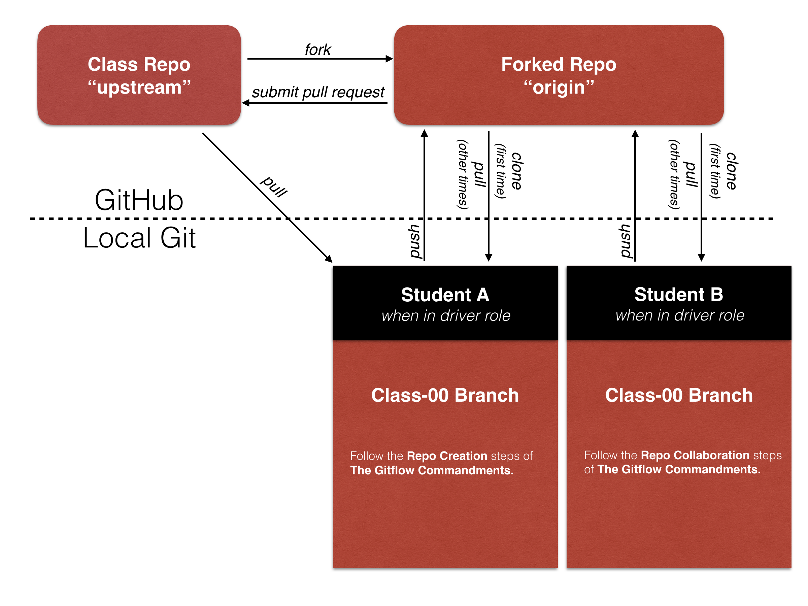

# Git Flow

Spend some time getting familiar with the new Git/GitHub & Pair Programming workflow that we'll utilize during labs throughout this course.

### Set up your repo

Here is the recommended workflow (*We reviewed this in class*):

1. Driver: fork the CF Lab 01 repository if you haven't done so already.
1. Your **forked repo** on GitHub will be your "origin" repo. Clone **your fork** to your local development environment:
  1. If you haven't done so yet, create a directory named "301" - `mkdir 301/` (This will be your parent 301 directory and set you up for organizational success!)
  1. Next, `cd 301/`
  1. `mkdir lab-assignments` to house the pair assignment repos.
  1. `cd lab-assignments`
  2. `mkdir my-forked-labs`
  3. `cd my-forked-labs`
  1. `git clone` this repo.
  1. `cd` into this repo.
  1. Immediately `git checkout -b <driverName-navigatorName>` (ex: `git checkout -b rick-jane`).  

### Write code together!

Find those `TODO` items in the code, and tackle one of them. When you finish a TODO **leave** it in your code. 

1. Driver: In your terminal, ensure that:
   - you are on a branch with you and your partner's namesake.
   - you are currently within the starter-code directory.
1. Type `code .` to open this starter-code folder as a project in VS Code.
1. Use the VS Code "Find in Project" (command shift "f" if on a Mac) to locate all the `TODO:` items.
1. Work through one or two TODO items before switching roles (or one hour, whichever arrives first), testing your code as you go.
1. In your terminal type `git status` to view the files that you have changed. You should only see the files that you have worked on.
2. Type `git diff` to see line-item changes with your down arrow key. (Type `q` to exit this mode!)
1. Type `git add file1 file2` where file1, file2, etc. are the files that you have changed.
1. Type `git status` to view the files that have been added to your commit. You should only see the files that you worked on.
1. Type `git commit -m "some meaningful message"` where Some meaningful message is a message that **thoroughly** explains your commit.
1. Type `git status` to ensure there is nothing left to commit.
1. Type `git push origin your-name-partner-name` to push this branch to your forked repo on GitHub.
2. On GitHub, add your navigator as a collaborator (go to settings -> collaborators).
3. Once they have been added, send your partner your forked repo link for them to clone down.

### Switch roles

1. Navigator (AKA new Driver): You can now clone the driver's fork, to your own local dev environment. If you haven't already:
2. `mkdir 301/` that will be the parent directory for all things 301.
3. `cd 301/`
4. `mkdir lab-assignments`
5. `cd lab-assignments`
6. `mkdir partners-forked-labs`
7. `cd partners-forked-labs`
8. The new driver (original navigator):
  1. `git clone` the repo your partner sent you into your navigator folder.
  2. `git fetch origin` branch-name
  2. Now open the starter-code in VS Code. It's your turn to have the hands on the keyboard!

---
